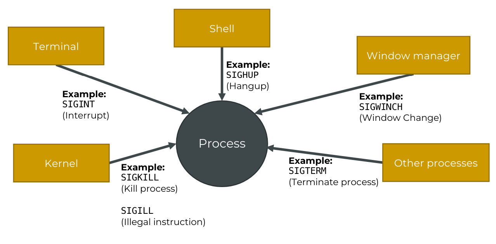
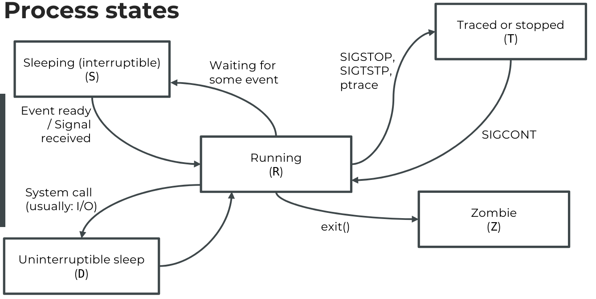

# Linux Process:

### 1. concept:
```
► A process:
    - An instance of a program
    - Independent execution unit with its own resources:
        + CPU & Memory resources
        + Opened files, network connections,...
    - It is managed by the kernel (lowest level of the operating system)
    - Each process has:
        + A process ID (pid)
        + A user under which this process runs under
        + A state (running, waiting, stopped, zombie)
        + And various other properties
► All processes are organized in a hierarchy!
```

### 2. ps command:

```
PID – the unique process ID
TTY – terminal type that the user is logged into 
TIME – amount of CPU in minutes and seconds that the process has been running 
CMD – name of the command that launched the process.
```
| Options | Description  |
| ------- | --- |
| a | List all ruining processes for all users.|
| -A, -e | Lists all processes on the entire system, offering a complete overview of running tasks and programs.|
| -a | List all processes except session leaders (instances where the process ID is the same as the session ID) and processes not associated with a terminal |
| f | Displays the hierarchy of processes in a visual ASCII art format, illustrating parent-child relationships |
| u | Expands the output to include additional information like CUP, MEM usage |
| -u | Specifies a username, listing processes associated with that user |
| x | includes processes without a TTY, showing background processes not tied to a specific terminal sessions |


##### 2.2. Getting the process ID for a program:
```
> ps aux | grep -F docker
root      1621  0.0  2.6 2466076 80312 ?       Ssl  09:48   0:12 /usr/bin/dockerd -H fd:// --containerd=/run/containerd/containerd.sock
root      2159  0.0  0.1 1235828 3552 ?        Sl   09:48   0:00 /usr/bin/docker-proxy -proto tcp -host-ip 0.0.0.0 -host-port 8000 -container-ip 172.20.0.2 -container-port 80
root      2167  0.0  0.1 1235828 3404 ?        Sl   09:48   0:00 /usr/bin/docker-proxy -proto tcp -host-ip :: -host-port 8000 -container-ip 172.20.0.2 -container-port 80

# get processID
> ps aux | pgrep docker

# Result:
1621
2159
2167
2183
2190
2207
2215

# get process:
> ps -eo pid,ppid,user,group,comm

# Result:
PID  PPID USER     GROUP    COMMAND
1     0 root     root     systemd
2     0 root     root     kthreadd
3     2 root     root     kworker/0:0
4     2 root     root     kworker/0:0H
5     2 root     root     kworker/u2:0
6     2 root     root     mm_percpu_wq
```
### 4. Signal:

##### 4.1 signal concept:
```
► Signals can be sent to processes, and they will interrupt the
process flow at a convenient time
► It's a mechanism to asynchronously notify a process of an event
► The operating system:
    - Is responsible for delivering the signal to the process
    - Maintains a signal queue, so we can send a signal to every process (even to one that is not active right now)
```


##### 4.2 checking all signal:

**command:**
```
kill -l
```

**Result:**
```
 1) SIGHUP	 2) SIGINT	 3) SIGQUIT	 4) SIGILL	 5) SIGTRAP
 6) SIGABRT	 7) SIGBUS	 8) SIGFPE	 9) SIGKILL	10) SIGUSR1
11) SIGSEGV	12) SIGUSR2	13) SIGPIPE	14) SIGALRM	15) SIGTERM
16) SIGSTKFLT	17) SIGCHLD	18) SIGCONT	19) SIGSTOP	20) SIGTSTP
21) SIGTTIN	22) SIGTTOU	23) SIGURG	24) SIGXCPU	25) SIGXFSZ
26) SIGVTALRM	27) SIGPROF	28) SIGWINCH	29) SIGIO	30) SIGPWR
31) SIGSYS	34) SIGRTMIN	35) SIGRTMIN+1	36) SIGRTMIN+2	37) SIGRTMIN+3
38) SIGRTMIN+4	39) SIGRTMIN+5	40) SIGRTMIN+6	41) SIGRTMIN+7	42) SIGRTMIN+8
43) SIGRTMIN+9	44) SIGRTMIN+10	45) SIGRTMIN+11	46) SIGRTMIN+12	47) SIGRTMIN+13
48) SIGRTMIN+14	49) SIGRTMIN+15	50) SIGRTMAX-14	51) SIGRTMAX-13	52) SIGRTMAX-12
53) SIGRTMAX-11	54) SIGRTMAX-10	55) SIGRTMAX-9	56) SIGRTMAX-8	57) SIGRTMAX-7
58) SIGRTMAX-6	59) SIGRTMAX-5	60) SIGRTMAX-4	61) SIGRTMAX-3	62) SIGRTMAX-2
```

##### 4.3 the signal: SIGINT
```
SIGINT:
    - usually sent from the terminal to a program
    - meant to indicate we would like to stop and regain control over our terminal
    - Programs can listen to that signals and perform custom  actions - including ignoring this signal!
for example:
    - when end a command with CTRL + C, we're sending the SIGINT signal to a program
```

##### 4.4 the signal: SIGTERM
```
SIGTERM:
    - is used to tell the process that is should terminate
```

**command:**
```
> kill [process ID]
or
> kill -s 15 [process ID]
or
> kill -s SIGTERM [process ID]
or
> kill -15 [process ID]
or
> kill -SIGTERM [process ID]
```

**for example**
```
> kill -s SIGTERM 45678
or
> kill -SIGTERM 45678
or
> kill -s 15 45678

```

##### 4.5 the signal: SIGKILL

**concept:**
```
We send the SIGKILL signal! This forcefully terminates the program
```

**Be careful:**
```
- this may cause data loss
- files might not have been written completely, or might be in an inconsistent state
```

**command:**
```
> kill [process ID]
or
> kill -s 9 [process ID]
or
> kill -s SIGKILL [process ID]
or
> kill -9 [process ID]
or
> kill -SIGKILL [process ID]
```

**for example**
```
> kill -s SIGKILL 45678
or
> kill -SIGKILL 45678
or
> kill -s 9 45678

```


##### 4.6 process with kill command: kill -s [SIGNAL] [process ID]

**command:**
```
> kill -s [SIGNAL] [process ID]
```

**For example:**
```
> kill -s SIGINT 45678
or
> kill -SIGINT 45678
```


### 5. Process state :
```
> ps aux:
USER       PID %CPU %MEM    VSZ   RSS TTY      STAT (process state) START   TIME COMMAND
root         1  0.0  0.2 159604  8884 ?        Ss                   09:48   0:02 /sbin/init
root         2  0.0  0.0      0     0 ?        S                    09:48   0:00 [kthreadd]
root         3  0.0  0.0      0     0 ?        I                    09:48   0:00 [kworker/0:0]
root         4  0.0  0.0      0     0 ?        I<                   09:48   0:00 [kworker/0:0H]
root         6  0.0  0.0      0     0 ?        I<                   09:48   0:00 [mm_percpu_wq]
root         7  0.0  0.0      0     0 ?        S                    09:48   0:00 [ksoftirqd/0]
root         8  0.0  0.0      0     0 ?        I                    09:48   0:02 [rcu_sched]
root         9  0.0  0.0      0     0 ?        I                    09:48   0:00 [rcu_bh]
```

**concept**


### 6. Top command :
```
► The program top allows us to display all processes from our system

► The most important parameters are:
    -u [username]: Show only processes owned by the specified user
    -d [seconds]: Set the delay between display updates, in seconds. The default value is 3 seconds
    -i: Start top with the "idle" processes hidden. This shows only the processes that are currently using CPU resources
    -c: Display the full command line used to start each process, instead of just the command name

► We can also interactively change the output:
    f key: We can press the f key to further customize the output
    k key: We can send signals to processes with this key (k = kill)
    r key: We can change the niceness of processes
    z key: We can switch to color mode, and with the uppercase Z key, we can configure it
    W key: Write the current configuration, so it is loaded the next
time we start top
```

**for example:**
```
# command1:
> sudo top -u deploy -d 1 -i -c
```