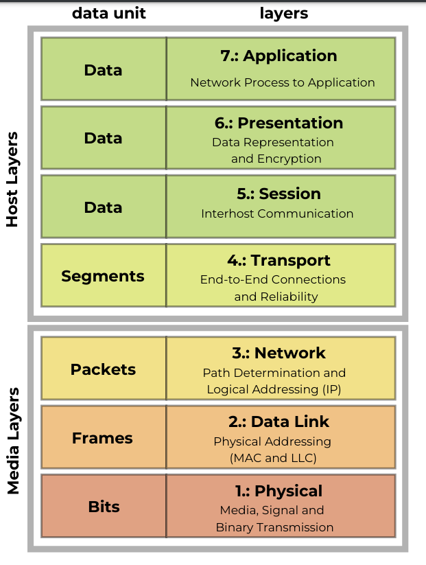

# NETWORKING - OSI

## I. The OSI model

### 1. introduction:

**a. definition**
```
- Open Systems Interconnection (OSI) model
- A conceptual framework for understanding and designing computer network
```

**Purpose**
```
- Standardizes the functions and protocols used in network communication

- Divides network communication into seven distinct layers, each with
specific responsibilities
```

**The idea:**
```
- We want competition, but they should be interoperable
- By learning the OSI model, we will be able to communicate more
clearly about potential networking problems
- We could say: "We got a problem on the data link layer", and the
problem is more clearly defined
```

### 2. The OSI model

**Application Layer (Layer 7)**
```
- Provides the interface for applications to communicate over
the network (e.g., HTTP, FTP, SMTP)
```

**Presentation Layer (Layer 6)**
```
- Translates, encrypts, and compresses data for transmission between applications and the network (e.g., TLS/SSL)
```

**Session Layer (Layer 5)**
```
- Manages and controls the establishment, maintenance, and termination of sessions between applications
```

**Transport Layer (Layer 4)**
```
- Ensures reliable data transfer between hosts (e.g., TCP, UDP)
```

**Network Layer (Layer 3)**
```
- Manages data routing and forwarding between networks (e.g., IP addresses, routers)
```

**Data Link Layer (Layer 2)**
```
- Provides error-free data transfer between adjacent network nodes (e.g., Ethernet, MAC addresses)
```

**Physical Layer (Layer 1)**
```
- Handles the transmission of raw data bits over a physical medium (e.g., cables, switches)
```



