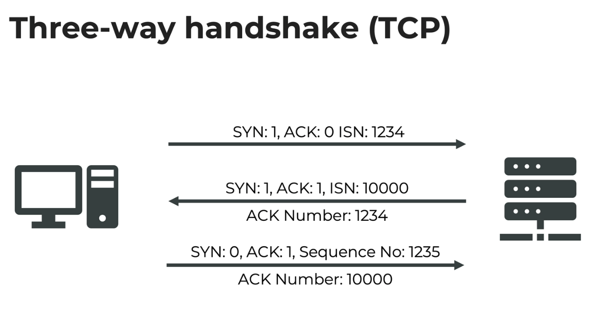

# NETWORKING - OSI

## I. The OSI model

### 1. introduction:

**a. definition**
```
- Open Systems Interconnection (OSI) model
- A conceptual framework for understanding and designing computer network
```

**Purpose**
```
- Standardizes the functions and protocols used in network communication

- Divides network communication into seven distinct layers, each with
specific responsibilities
```

**The idea:**
```
- We want competition, but they should be interoperable
- By learning the OSI model, we will be able to communicate more
clearly about potential networking problems
- We could say: "We got a problem on the data link layer", and the
problem is more clearly defined
```

### 2. The OSI model

**Application Layer (Layer 7)**
```
- Provides the interface for applications to communicate over
the network (e.g., HTTP, FTP, SMTP)
```

**Presentation Layer (Layer 6)**
```
- Translates, encrypts, and compresses data for transmission between applications and the network (e.g., TLS/SSL)
```

**Session Layer (Layer 5)**
```
- Manages and controls the establishment, maintenance, and termination of sessions between applications
```

**Transport Layer (Layer 4)**
```
- Ensures reliable data transfer between hosts (e.g., TCP, UDP)
```

**Network Layer (Layer 3)**
```
- Manages data routing and forwarding between networks (e.g., IP addresses, routers)
```

**Data Link Layer (Layer 2)**
```
- Provides error-free data transfer between adjacent network nodes (e.g., Ethernet, MAC addresses)
```

**Physical Layer (Layer 1)**
```
- Handles the transmission of raw data bits over a physical medium (e.g., cables, switches)
```


## II. Layer 1:  Physical layer of the OSI model

### 1. Introduction
```
Physical Layer (Layer 1) of OSI model
- Physical medium: Copper cables, fiber-optic cables, wireless
- Data transmission: Convert digital data to signals
- Signaling: Voltage levels, modulation synchronization

- Error detection: Basic methods, e.g., parity bits

- TLDR: We now have a physical connection, through which we can send bits
```

### 2. Layer 1: Enable/Disable device

**concept and command**
```
- We can also disable a device through software
- We first need to get the name of our device:
> ip addr show

- After this, we can enable / disable the device:
> ip link set dev <interface> up
> ip link set dev <interface> down
```

**example**
```
# command:
> ip link set dev enp0s5 down
```

## III. Layer 2: Data link layer

### 1. introduction:
```
The goal of layer 2:
- Reliable communication between devices on the same network

Divided into two sublayers:
- Logical Link Control(LLC)
    + Flow control and error detection
    + This is the interface between Data Link and Network Layers

- Media Access Control (MAC):
    + Unique hardware addresses (MAC addresses)
    + Gives us a way to identify the sender and receiver of a frame

Frame encapsulation:
- Organize data into frames for transmission
- Add source and destination MAC addresses
```

### 2. What is Ethernet (IEEE 802.3):
```
- Ethernet is a family of network technologies
- Mostly used in LAN (local area networks)
- Originally developed in the 1970s
- Ethernet splits the data into "frames"
- An ethernet frame:
    + Is usually max 1.5kb in size
    + Contains the actual data that we want to transfer (more on that later)
    + Contains a checksum so the destination can verify if it has received the data correctly
    + Also contains addressing information:
        * MAC of the source ethernet interface
        * MAC of the destination ethernet interface
```

### 3. What is WiFi?
```
What is WiFi (IEEE 802.11)?
- WiFi is wireless networking protocol
- The frames that are being sent are slightly different than the ones from Ethernet - they need to contain additional data responsible for wireless connections
- Still, they're highly compatible with each other:
    + Both protocols use MAC-addresses
    + A wireless access point can convert Ethernet frames into WiFi frames
```

### 4.What is a MAC address?
```
What is a MAC address?

MAC stands Media Access Control address
- Unique identifier for network interfaces
- 48-bit (6-byte) address

Address format:
- 6 groups of 2 hexadecimal digits, separated by colons (e.g., 01:23:45:67:89:AB)

Assigned by manufacturers:
- First 3 bytes: Organizationally Unique Identifier (OUI)
- Last 3 bytes: Device-specific identifier

Static by default but can be changed (spoofed) in software

We can show information about our network devices with the following command:
> ip addr show
```

## IV. Layer 3: Network layer

### 1. `Network layer`: introduction
```
- On layer 2, we could only send frame from one computer directly to another one. But if computer are not connected directly, we can't send messages through layer2
```
**the IDEA here:**
```
- We no longer work with MAC address, but with IP addresses
- We send "packets", Which are wrapped into frames at each step

- Those packets can be forwarded
- Our router could forward a packet that meant to be sent to the internet
```

### 2. `Network layer`: What is a network?

**Definition**
```
- A network is a group of interconnected devices that can communicate and share resources
- Devices can include computers, server, printers, routers, switches and more..
```

**Types of networks (that are important for us now):**
```
- Local Area Network (LAN): Covers a small geographic area, such as a home or office

- Wide Area Network (WAN): Spans larger distances (country, continent, global), often
connecting multiple LANs
```

**COMMAND:**
```
# show ip
> ip addr show

# show route:
> ip route show
or
> ip route
or
> route

```

### 3. `Network layer`: `subnet`
**What is a subnet?**
```
- Subnet is a network with a network
- this allows us to manage more computers
- they make `Large` networks more efficient

At home:
- Technically speaking, our home network is a subnet of the internet

In a corporate setting:
- We can split our corporate network into multiple subnets, and increase the efficiency
```

**The problem right now**
```
- How do we know where to send a frame to?
- If we want to send a packet to the internet... we need to send the frame to the router
- If we wand to send a packet to another computer in our network... we can directly send the frame to it
```

**Example1: We want to send a packet to another computer in our local network**
```
- We can send the `FRAME` directly to it:
- Btw this is always the case, even if  one computer connects through WiFi, and the other one through a LAN cable
- In this case, the router part of the router `will not be involved` - the wireless access component of the router will be responsible for sending this packet to the WiFi connected device
```

**Example2: We want to send a packet to the internet**
```
- We want to send a packet to the internet
- In this case, we need to send a packet to the router
- Which will forward it for us to the internet
```

### 4. `Network layer`: How to set IP address
**a. command:**
```
# add an ip address to the interface
> ip addr add [ip_address]/[prefix_length] dev [interface_name]

# delete an ip address from an interface:
> ip addr del [ip_address]/[prefix_length] dev [interface_name]
```

**b. example:**
```
# add an ip address to the interface
> ip addr add 192.168.100.1/24 dev enp0s3

# delete an ip address from an interface:
> ip addr del 192.168.100.1/24 dev enp0s3
```

### 5. `Network layer`: Route
**a. Show current command**
```
> route
or
> ip route show
```

**b. Show which gateway for specific destination:**
```
# command:
> ip route get [dest_ip_address]

# example:
> ip route get 192.168.1.100
> ip route get 8.8.8.8
```

**c. Change/add/edit/delete route**
```
# Add route command:
> ip route add [dest_ip_address] via [gateway] dev [interface]

# Delete route command:
> ip route del [dest_ip_address] via [gateway] dev [interface]

# example:
> sudo ip route add 10.100.1.0/24 via 0.0.0.0 dev enp0s3
```

### 6. `Network layer`: DHCP

**a. DHCP: Components**

DHCP server
```
- Stores IP address pool
- Manages IP address leases
- Assigns and reclaims addresses
```

DHCP client:
```
- Request IP address and configuration
- Renew or release leases
```

Important technical hint:
```
- DHCP helps us to manage layer 3, meaning that we can easily obtain the network configuration that we need
- Technically, DHCP is running on top of layer 4 (UDP). More on UDP
later!
```

**b. DHCP: the process**

step1: Discover
```
- Client broadcasts DHCP discover message
(to the whole network, to the address: 255.255.255.255)
- Searches for DHCP server
- Other clients will just receive, but ignore this message
```

step2: Offer
```
- DHCP server responds with DHCP offer message
- This message contains IP address and lease information
```

step3 Request
```
- Client sends DHCP request message
- Accepts IP address and lease terms
```
step4: Acknowledge
```
- Server sends DHCP acknowledge message
- Confirms IP address assignment and lease duration
```

**c. Inspect DHCP logs with `systemd-networkd`**
```
On systems that use systemd to also manage their network, we can just show the logs for this unit:

> journalctl -u systemd-networkd
```

**d. Inspect DHCP logs with `NetworkManager`**
```
On systems that use NetworkManager to also manage their
network, we can just show the logs for this unit:
> journalctl -u NetworkManager
```

### 7. `Network layer (Layer 3)`: ping
```
Sometimes we want to inspect our connection to another
computer
We can use the program ping for this:
-  ping 8.8.8.8
-  The protocol is called ICMP (Internet Control Message Protocol)
-  Our program will send a package (ICMP: "Echo request")to the
destination
-  If the destination supports the ICMP protocol, it should reply
with an ICMP "Echo reply" packet
-  This allows us to measure the roundtrip time to a remote server
```

### 8. `Network layer (Layer 3)`: Traceroute

**Traceroute concept**
```
- Network diagnostic tool
- Determines the path taken by data packets from source to destination
- Identifies network latency and potential routing issues
```

**Traceroute command**
```
> traceroute [ domain || ip]

# example
> traceroute google.com

#  result:
traceroute to google.com (142.250.71.238), 64 hops max
  1   10.0.2.2  0.311ms  0.312ms  0.401ms 
  2   192.168.0.1  0.828ms  0.433ms  0.200ms 
  3   *  *  * 
  4   116.97.90.97  4.599ms  3.638ms  4.166ms
  5   117.0.26.113  8.181ms  7.373ms  3.880ms 
  6   *  *  * 
  7   *  *  * 
  8   27.68.255.101  27.294ms  28.524ms  28.076ms 
  9   27.68.250.216  25.111ms  23.721ms  23.891ms 
 10   72.14.205.90  41.749ms  40.100ms  40.168ms 
 11   *  *  * 
 12   142.251.245.12  42.288ms  39.785ms  39.856ms 
 13   216.239.41.55  51.229ms  52.199ms  51.712ms 
 14   142.250.71.238  38.790ms  39.844ms  40.074ms

# example: set maximum hops (set max hops = 50)
> traceroute -m 50 facebook.com

# result:
[deploy@centos9-stream ~]$ traceroute -m 50 facebook.com
traceroute to facebook.com (157.240.7.35), 50 hops max, 60 byte packets
 1  _gateway (10.0.2.2)  0.393 ms  0.721 ms  0.393 ms
 2  _gateway (192.168.0.1)  0.699 ms  0.677 ms  0.588 ms
 3  * * *
 4  dynamic-ip-adsl.viettel.vn (116.97.90.97)  7.898 ms  7.593 ms  7.361 ms
 5  dynamic-ip-adsl.viettel.vn (116.101.125.70)  7.128 ms localhost (117.0.26.115)  6.917 ms localhost (117.0.26.113)  6.623 ms
 6  * * *
 7  * * *
 8  localhost (27.68.255.98)  59.804 ms * *
 9  dynamic-ip-adsl.viettel.vn (171.251.208.224)  59.821 ms  59.502 ms  59.201 ms
10  ae18.pr03.sin1.tfbnw.net (103.4.98.76)  68.989 ms  66.123 ms  62.631 ms
11  po203.asw03.sin6.tfbnw.net (129.134.55.106)  54.814 ms po203.asw04.sin6.tfbnw.net (129.134.55.110)  59.246 ms  57.152 ms
12  psw03.sin6.tfbnw.net (157.240.61.245)  58.957 ms  57.364 ms  58.192 ms
13  173.252.67.67 (173.252.67.67)  57.501 ms 157.240.38.149 (157.240.38.149)  59.078 ms 157.240.38.107 (157.240.38.107)  59.601 ms
14  * * *
15  * * *
16  * * *
...
48  * * *
49  * * *
50  * * *

```

**Traceroute Output**:
```
-  Hop number: Indicates the position of the router in the path
-  Router IP address/hostname: Identifies the intermediate router
-  RTT values: Latency measurements for each packet sent
```

**This allows us to identify potential issues:**
```
-  High latency: Indicates potential network congestion or problems
-  Asterisks (*): Indicates packet loss or unresponsive router
-  Routing loops: Repeated appearance of the same router in the output
```

## V. Layer 4: Transport layer

### 1.Until layer 3, we still had various problems:

**problem:**
```
- Packets might get lost or dropped
- If a router is overloaded, it will just drop packets
- We need to find a way how we want to deal with it
```

**There're 2 main ways to deal with it:**

UDP:
```
- We want our application to handle out-of-order / retransmissions
- Sometimes it's better to accept data loss, and not re-transmit the data
- Example: video call
```

TCP:
```
- This will be handled on Layer 4
- Packets will be ordered by the receiver, and retransmitted
```

### 2. `Layer4 Transport layer` TCP:

**a. TCP: Transmission Control Protocol**
```
- Connection-oriented protocol
- Provides reliable, ordered, and error-checked data transmission
- Operates at Transport Layer (Layer 4) of OSI model
- It allows us to write applications more easily:
- They can see the connection as a data stream, that contains the data in a correctly ordered way, without any parts missing
- in reality:
    + TCP is managing this
    + It orders the data for us, and handles retransmissions

- It also ensures we utilize the bandwidth that the receiver can handle / our connection can handle:
    + Flow control (what the receiver can handle)
    + Congestion control (what the connection can handle)
```

### 3. `Layer4 Transport layer` - TPC & UDP port:

**Ports in TCP & UDP**
```
- 16-bit numbers assigned to specific processes or services
- Range: 0-65535
- Differentiate between multiple connections on a single device

Types of TCP Ports:
-  Well-known ports (0-1023)
-  Reserved for standard services and protocols
-  Examples: HTTP (80), HTTPS (443), FTP (21), SSH (22)

Registered ports (1024-49151):
-  Assigned to specific applications by IANA (Internet Assigned Numbers Authority)
-  Examples: MySQL (3306), PostgreSQL (5432), VNC (5900)

Dynamic or private ports (49152-65535):
-  Not controlled by IANA
-  Available for any application to use on an as-needed basis
```

**TCP: Port communication**
```
Source port:
-  Randomly assigned from dynamic/private port range
-  Identifies the sending application on the client

Destination port:
-  Identifies the receiving application on the server
-  Typically, this is a well-known or registered port number

Port combination:
-  Unique combination of source IP, source port, destination IP, and destination port
-  Differentiates multiple connections between the same devices
-  Allows multiple connections to coexist without conflicts
```

**Most used `TCP` ports**
```
-  HTTP (80): Web server communication
-  HTTPS (443): Secure web server communication
-  FTP (20, 21): File Transfer Protocol
-  SSH (22): Secure Shell remote access
-  Telnet (23): Remote terminal access (unencrypted)
-  SMTP (25): Simple Mail Transfer Protocol
-  IMAP (143): Internet Message Access Protocol
-  POP3 (110): Post Office Protocol version 3
```

**Most used `UDP` ports:**
```
- DNS (53): Domain Name System
- DHCP (67, 68): Dynamic Host Configuration Protocol
- SNMP (161, 162): Simple Network Management Protocol
- TFTP (69): Trivial File Transfer Protocol
- NTP (123): Network Time Protocol
- RTP (5004, 5005): Real-time Transport Protocol(used for audio/video streaming)
```

### 4. `Layer4 Transport layer` - TPC handshake process:

**TPC handshake process**
```
- Step1: First, our computer sends a SYN packet to the remote computer
- Step2: The remote computer will send a SYN-ACK packet back to us
- Step3: And then, we will reply with an ACK packet - the connection is successfully established now
```




### 5. `Layer4 Transport layer` - The port scanner `Nmap`:

**command**
```
# scan specify the port(s) manually:
> nmap -p [port] [hostname / IP]
> nmap -p [port1],[port2] [hostname / IP]
> nmap -p [port1]-[port2] [hostname / IP]

# scan all ports:
> nmap -p - [hostname / IP]

# scan a range of `IP address`
> nmap [first-IP]-[last IP (last number)]
> nmap 192.168.1.12-100
```

**example**
```
# scan all ports:
> nmap -p - 192.168.56.98

# result:
Starting Nmap 7.80 ( https://nmap.org ) at 2024-07-03 00:38 +07
Nmap scan report for jenkins.duongdx.com (192.168.56.98)
Host is up (0.000061s latency).
Not shown: 65530 closed ports
PORT     STATE SERVICE
22/tcp   open  ssh
80/tcp   open  http
8080/tcp open  http-proxy
9000/tcp open  cslistener
9001/tcp open  tor-orport

Nmap done: 1 IP address (1 host up) scanned in 0.66 seconds
```

### 6. `Layer4 Transport layer` - Scan types in `Nmap`:

**-sS (TCP-SYN-Scan):**
```
-  The default scan method, if available
-  Nmap builds the packets and sends them
- Relatively fast
- Sends a SYN packet to establish a TCP connection,but doesn't follow through with the full connection
- But we might need additional privileges (root)

If we receive a:
-  SYN/ACK: This port is open
-  RST (reset) message: This port is closed
-  No message: This port is probably blocked / filtered
```

**-sT (TCP-connect-scan)**:
```
The default, if SYN-scan is not possible:
-  User has not enough permissions to do a SYN-scan
-  We're trying to scan an IPv6 network
-  Here, Nmap is using functionality of the operating system to
create a connection
-  This means we do the full handshake with the remote
server:
-  SYN, SYN-ACK, ACK
-  And then just close the connection
-  This is especially prone to:
-  Be slower
-  Can cause crashing at the other side
-  Might cause logs at the other side
```

**-sU (UDP-scan):**
-  We can use this to scan for open UDP ports
-  UDP works differently than TCP though
-  The idea here:
-  We send a UDP packet to the remote destination
-  And if we get a reply, the port will be marked as "open"
-  If we get an error back, we will mark this port as "filtered"
-  If we don't get a reply, we will mark the port as "open|filtered"
-  Important:
-  UDP port scanning is extremely slow
-  And we need to test each port multiple times as our request might
have gotten lost on the way


**Example**:
```
# -sS (TCP-SYN-Scan) -  (must use sudo, because no-root user don't have privileges to establish connection)
> sudo nmap -sS 192.168.56.98

# -sT (TCP-connect-scan)
> nmap -sT 192.168.56.98

# -sU (UDP-scan):
> nmap -sU 192.168.56.98
```

### 7. `Layer4 Transport layer` - Network Address Translation `NAT`:

```
-  Let's say you want to make a service available to the internet
-  And you're behind a NAT
-  How do you do this?
-  You need to tell your router, that when receiving requests on port 80 (or any
other port), they should be forwarded to one of the devices in the network
-  Example:
-  Port 80 should be forwarded to 192.168.1.3 on Port 8080
-  You should then reserve IP <-> MAC address combination for the IP
192.168.1.3 (so that no other DHCP client will get assigned this IP)
-  If your home IP address changes: You might need to use a service for
accessing dynamic IPs (such as "dyndns" or others)
-  Then you could use a domain such as:
-  myhost123.dyndns.com to access your local computer from the
internet
```
